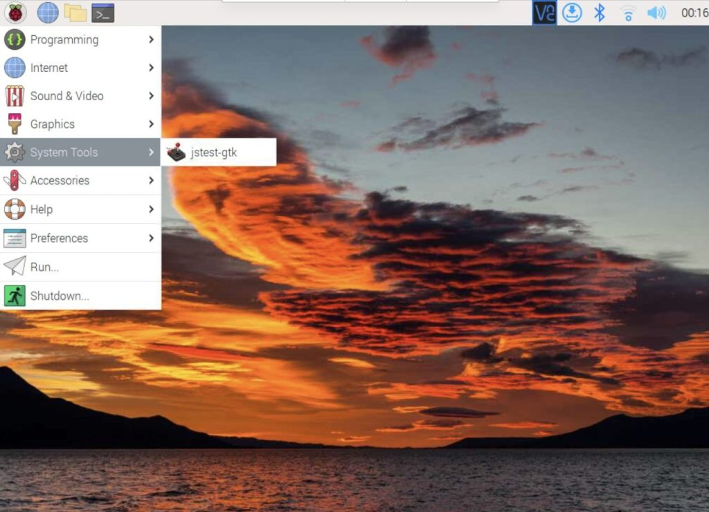
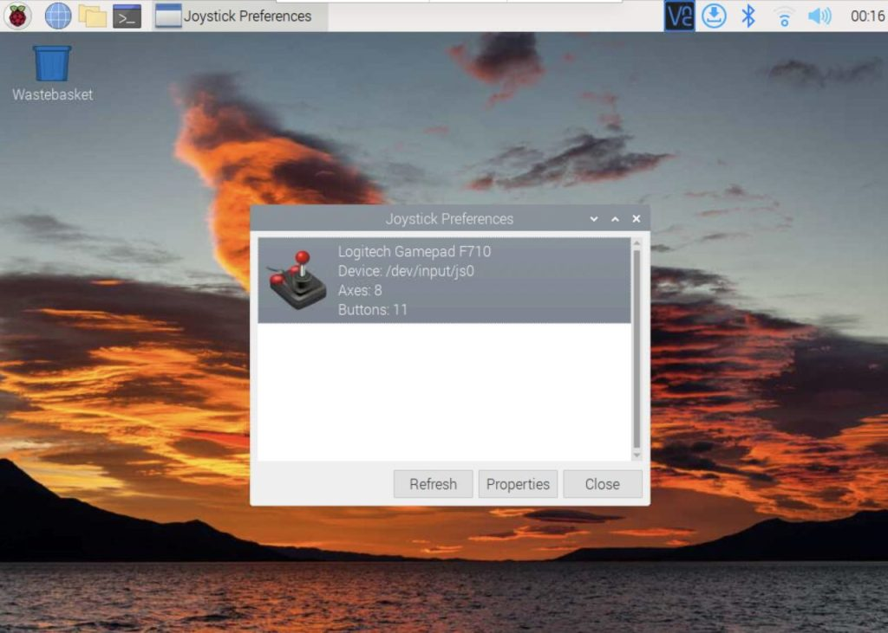
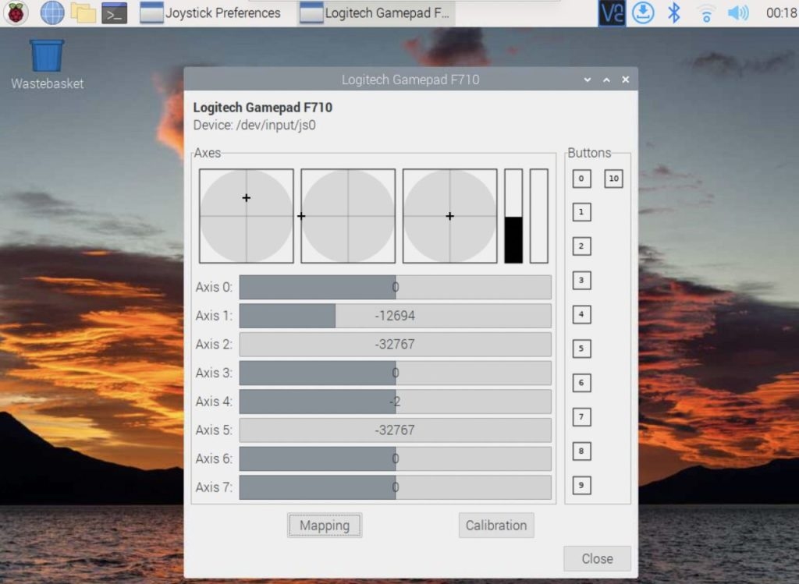

# ゲームパッドからTelloを操作

# はじめに

ゲームパッドをRaspberry Piに接続し、ドローン（Tello）を操作するPythonのプログラムを作成する方法です。ドローン（Tello）をプログラムから操作するために、djitellopyライブラリを用いています。Raspberry Piに接続したゲームパッドの操作を認識できるようにするために、joystickパッケージをインストールします。Raspberry Piに接続したゲームパッドの操作を正しく読み取れているかを確認するためにjstest-gtkパッケージをインストールします。ゲームパッドの操作をPythonのプログラムから認識するためにpygameライブラリを用いています。最後に作成したプログラムを示します。

# 動作環境

- Raspberry Pi 4 Model B Rev 1.4 (Raspberry Pi OS (64-bit) - Debian GNU/Linux 12 (bookworm))
- Logicool F310 Gamepad
- Tello EDU
- Wi-Fiアダプター（無線LAN子機）BUFFALO WMR-433W2 Series
- Python 3.11.2
- djitellopy 2.5.0
- pygame 2.6.0
- joystick 1.8.1-1 arm64
- jstest-gtk 0.1.1~git20160825-4 arm64

# djitellopyライブラリのインストール

Telloドローンをプログラムで操作するために必要なdjitellopyライブラリをインストールする。

```bash
$ pip3 install djitellopy
```

# joystickパッケージのインストール

Raspberry Piからゲームパッドを使用するには、joystickパッケージをインストールする必要があります。
以下のコマンドでjoystickパッケージをインストールしてください。

```bash
$ sudo apt install joystick
```

# joystick動作確認パッケージ jstest-gtk

jstest-gtkをインストールするとGUIでjoystickの動作確認ができます。

### インストール

以下のコマンドでjstest-gtkパッケージをインストールできます。

```bash
$ sudo apt install jstest-gtk
```

### 動作確認

インストールした jstest-gtk はラズパイのSystem Toolsの中に入っています。クリックして開きます。



ゲームパッドをラズパイのUSBポートに挿し、認識されているか確認する。認識されない場合は、USBポートが挿さっているか確認したのち、”Refresh”ボタンを押してみてください。”Properties” ボタンをクリックすると、ゲームパッドの操作がリアルタイムで表示される画面に移ります。



ゲームパッドを操作し、どの操作がどのようにコンピュータに認識されているか確認できます。
ただし、スティック操作の数値の範囲はPython側で読み取ると別の範囲として認識されます（プラスマイナスは同じ）。



# pygameモジュールのインストール

ゲームパッドの入力を取得するには `pygame` を使用します。
pygameモジュールはゲームパッドの入力を取得するだけでなくPythonで簡単なゲームを作成することができるライブラリです。
以下のコマンドでpygameモジュールをインストールできます。

```bash
$ pip3 install pygame
```

# プログラムに使われている主要な関数の説明

## `pygame.joystick.Joystick()`

ゲームパッドのオブジェクトを作成する。オブジェクトとはデータ（属性やプロパティ）と、そのデータに関連する動作（メソッドや関数）を一つにまとめたものです。

### `pygame.joystick.Joystick()` オブジェクトの関数

`.get_axis(スティックナンバー)` ：スティックの値を取得
*操作レバーの現在の傾き位置を取得します。 `スティックナンバー` に取得したいスティックのナンバーを指定します。*
スティックの傾き位置を戻り値として返します。取得される値は-1から1の範囲となり、値が0の場合レバーは中央にあります。

`.get_button(ボタンナンバー)` ：ボタン類の値を取得
*現在のボタンの状態を取得します。 `ボタンナンバー` に取得したいボタンのナンバーを指定します。*
ジョイスティック機器に搭載されたボタンの現在の状態を `True か False` として返します。 `True` の場合はボタンが押されているという意味、 `False` の場合はボタンが押されていないという意味になります。

### 自作関数`map_axis(数値)` の説明

この関数 `map_axis(数値)` は、スティックの入力値をドローンが認識できる範囲の値に変換するためのものです。具体的には、スティックの入力値が -1.0 から 1.0 の範囲であるのに対し、ドローンは -100 から 100 の範囲の値を必要とします。この変換を行うのが `map_axis()` 関数です。 `数値` にゲームパッドから取得した値を指定します。
計算方法として、線形補間を用いている。線形補間とは、次のように2点 $(x0, y0)$ と $(x1, y1)$ を直線で結んだ時に、間にある任意の $x$ 座標に対応する $y$ を計算することです。


線形補間の基本式は次の式になります。

$$
y = y_0 + (y_1 - y_0) \frac{x - x_0}{x_1 - x_0}
$$

 $x_0$ `(in_min = -1)` から $x_1$ `(in_max = 1)` の範囲の値である $x$ を用いて、 $y_0$ `(out_min = -100)` から $y_1$ `(out_max = 100)` の範囲の値である $y$ を求めている。

### もっとわかりやすい説明

**入力値の範囲内での位置を計算**

```python
(val - in_min) / (in_max - in_min)
```

ここでは、入力値 `val` が入力範囲内のどこに位置するかを計算しています。

$$
\frac{0.5 - (-1)}{1 - (-1)} = \frac{1.5}{2} = 0.75
$$

これは、 `val`が入力範囲の75%の位置にあることを意味します。

**出力範囲にスケーリング**

```python
(out_max - out_min) * ((val - in_min) / (in_max - in_min))
```

次に、この位置を出力範囲にスケーリングします。

$$
(100 - (-100)) \times 0.75  = 200 \times 0.75 = 150
$$

**出力範囲の最小値を加算**

```python
out_min + (out_max - out_min) * ((val - in_min)  / (in_max - in_min))
```

最後に、出力範囲の最小値を加算して、最終的な出力値を得ます。

$$
(-100) + 150 = 50
$$

これにより、入力値 0.5 が出力値 50 に変換されます。

# プログラム

```python
#!/usr/bin/env python
# -*- coding: utf-8 -*-

import sys
import time
from djitellopy import Tello, TelloException
import pygame
from pygame.locals import JOYAXISMOTION, JOYBUTTONDOWN
from functools import cache
import cv2
from queue import Queue
from threading import Thread

class TelloCameraStream:
    def __init__(self, ip, port):
        self.ip = ip
        self.port = port
        self.is_running = True  # ストリームが動作中かのフラグ
        self.is_recording = False  # 録画中かのフラグ
        self.is_take_picture = False  # 写真を撮るかのフラグ
        # カメラストリームを取得
        self.cap = cv2.VideoCapture(f'udp://{ip}:{port}')
        # 画像の幅と高さを設定
        self.width = int(self.cap.get(cv2.CAP_PROP_FRAME_WIDTH) / 2)
        self.height = int(self.cap.get(cv2.CAP_PROP_FRAME_HEIGHT) / 2)
        # フレームレートを取得
        self.fps = int(self.cap.get(cv2.CAP_PROP_FPS))
        self.video_writer = None
        self.frame_name = f'Tello {self.ip}'
        self.frame_queue = Queue(maxsize=1)  # 最新フレームを保持するキュー
        # フレームをキャプチャするスレッドを開始
        self.thread = Thread(target=self._capture_frames, daemon=True)
        self.thread.start()

    def _capture_frames(self):
        while self.is_running:
            ret, frame = self.cap.read()
            if ret:
                # 最新フレームのみを保持
                if not self.frame_queue.empty():
                    # キューからフレームを取り出す
                    self.frame_queue.get_nowait()
                self.frame_queue.put(frame)

    def display_stream(self):
        if self.is_running:
            if not self.frame_queue.empty():
                frame = self.frame_queue.get()
                # フレームのリサイズ
                resized_frame = cv2.resize(frame, (self.width, self.height), interpolation=cv2.INTER_LINEAR)
                cv2.imshow(self.frame_name, resized_frame)

                # 録画中ならフレームを保存
                if self.is_recording and self.video_writer:
                    self.video_writer.write(resized_frame)

                # 写真を撮る処理
                if self.is_take_picture:
                    now = time.strftime('%Y%m%d_%H%M%S')
                    ip_suffix = self.ip.split('.')[-1]
                    cv2.imwrite(f'picture_{ip_suffix}_{now}.png', resized_frame)
                    print(f'[INFO] Picture saved as picture_{ip_suffix}_{now}.png')
                    self.is_take_picture = False

                # ESCキーが押されたら、また、ウィンドウが終了したらストップ
                if cv2.waitKey(1) & 0xFF == 27 or cv2.getWindowProperty(self.frame_name, cv2.WND_PROP_AUTOSIZE) == -1:
                    self.stop()

    def take_picture(self):
        self.is_take_picture = True  # 写真を撮るフラグを立てる

    def start_recording(self):
        now = time.strftime('%Y%m%d_%H%M%S')
        file_name = f'video_{self.ip.split(".")[-1]}_{now}.avi'

        # ビデオライターを初期化して録画を開始
        self.video_writer = cv2.VideoWriter(
            file_name,
            cv2.VideoWriter_fourcc(*'XVID'),
            self.fps,
            (self.width, self.height)
        )
        self.is_recording = True
        print(f"[INFO] Recording started: {file_name}")

    def stop_recording(self):
        if self.is_recording and self.video_writer:
            self.video_writer.release()  # 録画を停止
            self.video_writer = None
        self.is_recording = False
        print("[INFO] Recording stopped")

    # ストリームを停止
    def stop(self):
        self.is_running = False  # ストリームを停止
        self.thread.join()  # スレッドを終了
        if self.cap.isOpened():
            self.cap.release()  # カメラを開放
        cv2.destroyAllWindows()  # ウィンドウを閉じる
        if self.is_recording and self.video_writer:
            self.video_writer.release()  # 録画を停止

    # ストリームが動作中かどうかを返す
    def is_run(self):
        return self.is_running


def main():
    LOCAL_IP = '192.168.13.3'
    LOCAL_PORT_VIDEO = '11111'

    # pygameの初期化
    pygame.init()

    # Joystickオブジェクトの作成
    joystick = pygame.joystick.Joystick(0)
    joystick.init()
    print(f'Gamepad Name: {joystick.get_name()}')

    # Telloの初期化
    # Wi-Fiアクセスポイントへ接続する設定（Wi-Fi子機になるモード）にしている場合は
    # hostを指定してIPアドレスは現物に合わせる
    Tello.RETRY_COUNT = 1          # retry_countは応答が来ないときのリトライ回数
    Tello.RESPONSE_TIMEOUT = 0.01  # 応答が来ないときのタイムアウト時間
    tello = Tello(host=LOCAL_IP)

    try:
        tello.connect()  # Telloへ接続
        tello.streamoff()  # 誤動作防止の為、最初にOFFする
        tello.streamon()  # 画像転送をONに
        # カメラストリームを初期化
        camera_stream = TelloCameraStream(LOCAL_IP, LOCAL_PORT_VIDEO)
    except KeyboardInterrupt:
        print('\n[Finish] Press Ctrl+C to exit')
        sys.exit()
    except TelloException:
        print('\n[Finish] Connection timeout')
        sys.exit()

    while True:
        try:
            # カメラストリームを表示
            camera_stream.display_stream()

            # イベントの取得
            for event in pygame.event.get():
                # イベントがスティック操作の場合
                if event.type == pygame.locals.JOYAXISMOTION:
                    send_tello(tello,
                               'rc',
                               map_axis(round(joystick.get_axis(3), 2)),
                               map_axis(-round(joystick.get_axis(1), 2)),
                               map_axis(-round(joystick.get_axis(4), 2)),
                               map_axis(round(joystick.get_axis(0), 2))
                    )
                # イベントがボタン操作の場合
                elif event.type == pygame.locals.JOYBUTTONDOWN:
                    if joystick.get_button(7):
                        send_tello(tello, 'takeoff')
                    elif joystick.get_button(6):
                        send_tello(tello, 'land')
                    elif joystick.get_button(3):
                        send_tello(tello, 'flip_forward')
                    elif joystick.get_button(0):
                        send_tello(tello, 'flip_back')
                    elif joystick.get_button(2):
                        send_tello(tello, 'flip_left')
                    elif joystick.get_button(1):
                        send_tello(tello, 'flip_right')
                    elif joystick.get_button(5):
                        camera_stream.take_picture()
                    elif joystick.get_button(4):
                        if not camera_stream.is_recording:
                            camera_stream.start_recording()
                        else:
                            camera_stream.stop_recording()
                    elif joystick.get_button(8):
                        print('[Finish] Press emergency button to exit by Gamepad')
                        send_tello(tello, 'emergency')
                        camera_stream.stop()
                        term_process(tello)

            # ストリームが停止している場合は、Telloを緊急停止
            if not camera_stream.is_run():
                send_tello(tello, 'emergency')
                term_process(tello)
        # Ctrl+Cが押された
        except KeyboardInterrupt:
            print('[Warnning] Press Ctrl+C to exit')
            send_tello(tello, 'emergency')
            camera_stream.stop()
            term_process(tello)
        # その他のエラーが発生した
        except Exception as e:
            print(f'[ERROR] Unexpected error: {e}')
            send_tello(tello, 'emergency')
            camera_stream.stop()
            term_process(tello)

# 終了処理
def term_process(tello):
    print('[Finish] Game finish!!')
    tello.streamoff()
    tello.end()
    sys.exit()

# send_rc_control(left_right, forward_backward, up_down, yaw)
# left_right                 left -100 ...  100 right
# forward_backward           forw  100 ... -100 backw
# up_down                      up  100 ... -100 down
# yaw (rotate)      counter clock -100 ...  100 clock
def send_tello(tello, cmd, left_right=0, forward_backward=0, up_down=0, yaw=0):
    try:
        if cmd == 'rc':
            tello.send_rc_control(left_right, forward_backward, up_down, yaw)
        elif cmd == 'land':
            tello.land()
        elif cmd == 'takeoff':
            tello.takeoff()
        elif cmd == 'flip_forward':
            tello.flip_forward()
        elif cmd == 'flip_back':
            tello.flip_back()
        elif cmd == 'flip_left':
            tello.flip_left()
        elif cmd == 'flip_right':
            tello.flip_right()
        elif cmd == 'emergency':
            print('\nEmergency Stop!!\n')
            tello.emergency()
            print(f'[Battery] {tello.get_battery()}%')
    except TelloException:
        print('[ERROR] Error occurred when sending tello command ')

# スティックの出力数値を調整
# -1.0 ~ 1.0 の数値を -100 ~ 100 の数値に変換
# 線形補間を用いて計算している
@cache
def map_axis(val):
    # 小数点以下2桁に四捨五入

    # 入力の最小値と最大値
    in_min = -1
    in_max = 1
    # 出力の最小値と最大値
    out_min = -100
    out_max = 100
    # 線形補間を用いて計算
    return int(out_min + (out_max - out_min) * ((val - in_min) / (in_max - in_min)))

if __name__ == '__main__':
    main()
```
